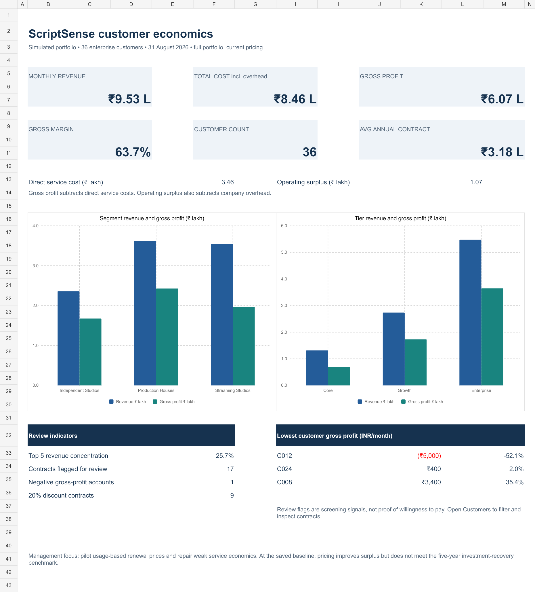

# ScriptSense — B2B Enterprise Pricing & Investment Recovery Strategy

**A portfolio case study using fictional/simulated business data. No confidential client data, real fundraising facts or achieved commercial results are represented.**

ScriptSense is an early-stage B2B generative-AI platform for movie-script analysis in this case narrative. An assumed ₹2.5 crore seed investment funded its initial build. The decision: improve cost-plus subscription pricing using customer value and usage, while evaluating profitability and investment recovery.

## Deliverables
- [Finished Excel dashboard](dashboard/ScriptSense_Dashboard.xlsx): executive KPIs, segment/tier charts, customer economics, pricing selector and recovery model.
- [Business recommendations](docs/03_findings.md) and [assumptions/data dictionary](docs/01_case_and_data_dictionary.md).
- [SQL analysis](sql/04_analysis.sql), [schema](sql/01_schema.sql), [data load](sql/02_seed_alternative.sql) and [reproduction guide](docs/02_mysql_walkthrough.md).
- [36 source customers](data/raw/customers.csv), [calculated customer economics](data/processed/customer_economics.csv) and [scenario results](data/processed/scenario_summary.csv).
- [Validation evidence](docs/validation.md) and [interview walkthrough](docs/04_interview_walkthrough.md).



## Scope and data model
Exactly 36 fictional enterprise customer organizations; one snapshot at 31 August 2026. Three segments: Independent Studios, Production Houses and Streaming Studios. Three subscription tiers: Core, Growth and Enterprise. Customers join to tier settings by tier_id; a one-row assumptions table holds company costs and investment, and a scenario table holds adoption/retention. No transaction warehouse or unsupported customer-acquisition model is added.

## Tools and methodology
MySQL 8.0 for schema, joins, aggregate analysis, ranking and scenario views; Excel for tables, formula summaries, editable assumptions, scenario selection and native charts. An independent decimal calculation reconciles the SQL and workbook baseline. Power BI is outside the final scope.

The analysis moves from source rows to direct service costs, gross profit, weighted margin, segment/tier performance, weak contracts, customer concentration, proposed usage-based charges and steady-state investment recovery. Current data remains the baseline; no claimed historical improvement is fabricated.

## Key findings
Current monthly revenue is ₹9.53 lakh, direct service cost ₹3.46 lakh, gross profit ₹6.07 lakh and gross margin 63.70%. Total monthly company cost is ₹8.46 lakh including ₹5 lakh overhead. Operating surplus is ₹1.07 lakh. Average annualized contract value is ₹3.1755 lakh.

C012 loses ₹5,000/month before overhead and C024 earns only ₹400. The five largest accounts provide 25.72% of revenue. 17 contracts have a margin, usage or discount review signal, which is not proof of willingness to pay.

## Pricing strategy and recovery
Test monthly list bases of ₹12,960 / ₹27,500 / ₹56,000 with 25 / 80 / 250 included script-analysis runs and ₹200 / ₹150 / ₹100 overage. Preserve existing base discounts in the model. These rates are hypotheses for renewal pilots, not externally validated optimal prices.

| Scenario | Revenue ₹ lakh/month | Gross profit ₹ lakh/month | Gross margin | Surplus ₹ lakh/month | Payback years |
|---|---:|---:|---:|---:|---:|
| Current | 9.53 | 6.07 | 63.70% | 1.07 | 19.50 |
| Conservative | 9.97 | 6.58 | 66.00% | 1.58 | 13.20 |
| Base | 10.27 | 6.99 | 68.02% | 1.99 | 10.48 |
| Upside | 10.81 | 7.36 | 68.02% | 2.36 | 8.84 |

Base assumes full adoption and 95% retention; Conservative assumes 50% adoption and 98% retention; Upside assumes full adoption and retention, without growth. **None recovers ₹2.5 crore within the illustrative five-year benchmark.** Pricing helps but cannot solve the recovery objective alone at this scale. Pilot renewals, review support-heavy contracts, monitor concentration and measure accepted customer value before committing to rollout.

## Using the workbook
Open Dashboard for current full-portfolio KPIs and charts. Pricing has a scenario dropdown plus current/proposed tier prices, impact and recovery. Assumptions contains editable blue inputs; Customers contains the 36 source rows and formula-based economics in a filterable table. Analysis contains group summaries, rankings and review counts. Recovery contains annual cash checkpoints. Formula summaries are used instead of PivotTables to keep the model easy to trace. No macros or external connections are required.

## Assumptions and limitations
Revenue is a recurring run rate with same-month cash collection. Hosting and support are direct service costs; overhead is separate. Recovery divides an assumed wholly unrecovered seed amount by positive operating surplus, not by revenue. No tax, growth, recurring churn, inflation, future capital expenditure, working-capital timing, discounting or equity-investor distribution is modelled. Costs scale with one-time retention except full overhead; the workbook also tests sticky support costs. Long payback estimates are comparisons, not long-term forecasts. See the data dictionary for every assumption.

## Project structure
```text
data/raw/          36 customers, tier settings, assumptions and scenarios
data/processed/    Reconciled customer, group, scenario and recovery results
sql/               Schema, two alternative imports, views, analysis and checks
dashboard/         Finished Excel workbook
docs/              Case, reproduction, recommendations, interview guide and validation
```

Private repository created for this project: https://github.com/vishnuvardhanvelpuru-ui/scriptsense-pricing-investment-recovery . Visibility must remain private unless explicitly changed by the owner. See validation for the completed SQL and Excel checks.
